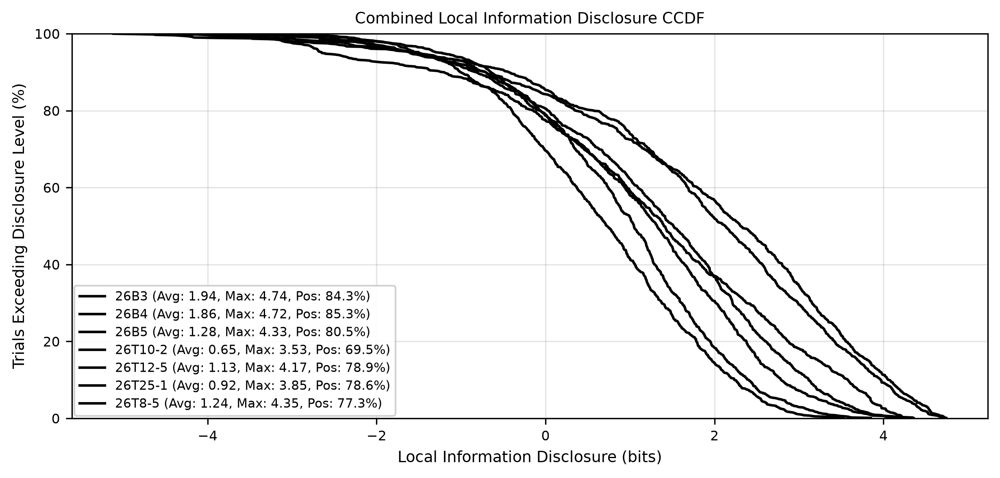
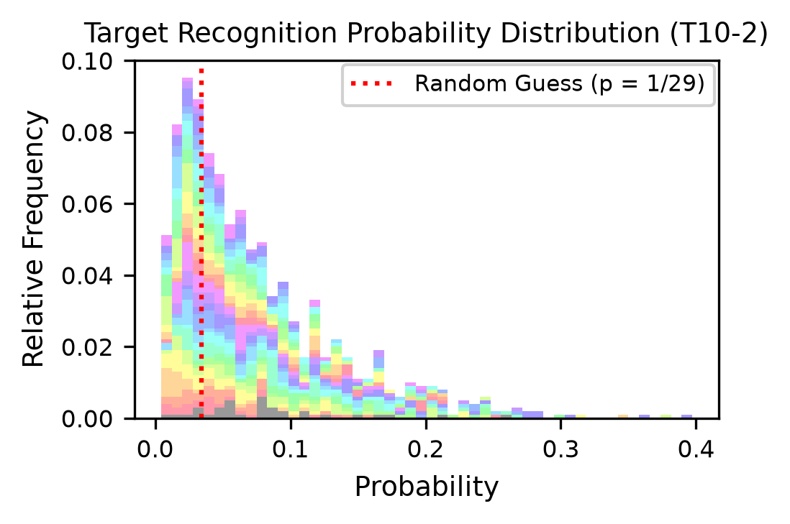
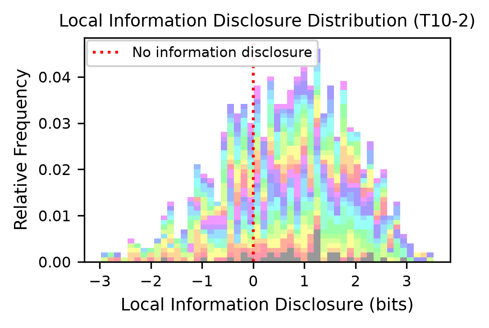

# Local Information Disclosure (LID)

This repository provides the implementation of the LID privacy metrics, designed to evaluate 1-to-N linkage threats in voice anonymisation.

It contains the code, data, and pipeline to reproduce the experiments and figures from our paper: [*Goodbye Equal Error Rate, Hello Local Information Disclosure: Evaluating Voice Anonymisation against 1-to-N Linkage Threats*](https://arxiv.org/abs/2607.06259).

Below is the LID score distribution for the VoicePrivacy 2024 challenge systems (graph generated by this code):



## Core idea

The empirical evaluation of linkage-based speech privacy depends on the interaction of the following three components:
1. **The Protector:** The anonymisation mechanism applied to the speech.
2. **The Attacker:** The specific feature extraction model (such as fine-tuned ECAPA-TDNN).
3. **The Dataset:** The underlying speech dataset.

Change any of these three, and the evaluation outcome changes. This codebase evaluates a single snapshot of interaction between the three.


## Quick Start

We use [`uv`](https://docs.astral.sh/uv/) for managing Python dependencies. 

To reproduce the experiments in the paper:

```bash
# Install uv if you do not have it
curl -LsSf https://astral.sh/uv/install.sh | sh

# Install dependencies and execute the full evaluation pipeline
uv sync
uv run src/pipeline/run_all_results.py
```

## Data & Components
This framework requires two distinct datasets with non-overlapping speaker identities:
* A **development set** ($\mathcal{D}_\mathrm{dev}$) to learn the calibration parameters.
* An **evaluation set** ($\mathcal{D}_\mathrm{eval}$) to compute the final information disclosure metrics.

Each dataset must be partitioned into an **enrolment set** ($\mathcal{E}$) containing known identity profiles, and a **trial set** ($\mathcal{T}$) representing intercepted audio samples. 

### Included Pre-computed Data
To allow for easy reproducibility, the `data/` folder includes pre-computed embeddings based on the standard VoicePrivacy 2024 (VPC) enrol/trial splits of the **LibriSpeech** dataset (`dev` and `eval`). 

These embeddings were generated by simulating a **semi-informed attacker** (a fine-tuned ECAPA-TDNN model) against:
* **VPC 2024 Baselines:** B3, B4, and B5.
* **VPC 2024 Top Systems:** T8-5, T10-2, T12-5, and T25-1.
* **Plain baseline:** Unmodified, non-anonymised original speech.
* **Random baseline:** Randomly generated embeddings (maintaining the exact number of speakers and utterances) to simulate theoretical perfect privacy (unlinkability).


## Evaluating Custom Experiments

While this repository includes prepared experiments to easily reproduce our paper, you can also use it to evaluate your own speech anonymisation system.

**! Note for semi-informed attackers:** If you are simulating a semi-informed attacker, ensure your attacker model is fine-tuned on a dataset that is *strictly disjoint* from any data used in this evaluation framework.


**1. Prepare your embeddings**
First, anonymise your speech data. Next, simulate your attacker (e.g., using an ECAPA-TDNN model) to extract embeddings for every anonymised speech sample.

**2. Structure your data**
Clear the existing `data/experiments/` directory. Create a new folder for your experiment. The pipeline expects the following structure:

```text
data/
├── shared/                  # CSV split definitions (Required)
│   ├── dev_enrolls.csv
│   ├── dev_trials.csv
│   ├── test_enrolls.csv
│   └── test_trials.csv
└── experiments/
    └── my_custom_system/    # Your experiment name
        └── embeddings/
            └── embeddings.parquet
```

* **The CSV files** (`data/shared/`): Must contain `utterance_id` and `speaker_id` columns.
* **The Parquet file** (`embeddings.parquet`): Must contain `utterance_id`, `speaker_id`, and `embedding` columns. It represents the attacker model's output. (You can place multiple experiment folders inside `data/experiments/`).

**Alternatively: use existing similarity scores.** It is also possible to run the evaluation with pre-computed similarity scores. In that case provide:

```text
data/
├── shared/                  # CSV split definitions (Required)
│   ├── dev_enrolls.csv
│   ├── dev_trials.csv
│   ├── test_enrolls.csv
│   └── test_trials.csv
└── experiments/
    └── my_custom_system/    # Your experiment name
        └── scores/
            ├── dev_scores.csv
            └── test_scores.csv
```

Both score files must be CSV files with this header:

```text
enroll_spk,trial_spk,trial_id,score
```

If `embeddings/embeddings.parquet` is absent, the pipeline uses these files and skips the first two steps.


**3. Prepare Baselines (Optional but Recommended)**
To properly contextualize your privacy metrics, it is best practice to compare your system against two extremes:

* **Random Baseline (Perfect Privacy):** If you wish to compare your results against theoretically unlinkable embeddings, run the following tool:
  ```bash
  uv run src/tools/generate_random_embeddings.py my_custom_system
  ```
  This creates a new experiment folder populated with randomly generated embeddings that match the exact dimensional structure of your `my_custom_system` experiment.
* **Plain Baseline (No Privacy):** Run your attacker against the original, non-anonymised audio. Place these embeddings in `data/experiments/plain/` to establish the maximum possible empirical privacy loss for your dataset.

**4. Run the evaluation**
Execute the pipeline to generate all metrics and plots for your new experiment:
```bash
uv run src/pipeline/run_all_results.py
```

## Longitudinal Leakage

After the main pipeline has calibrated the score files, aggregate all trial LLR
vectors belonging to the same speaker and fit longitudinal calibration parameters
on development speakers with:

```bash
# Process every experiment.
uv run src/long_leakage/run_longitudinal_analysis.py

# Or process selected experiments.
uv run src/long_leakage/run_longitudinal_analysis.py \
  --experiments B3 T10-2
```

For each experiment, outputs are written to `data/experiments/<experiment>/long/`:

* `scores.csv`: summed and averaged LLRs for every trial-speaker/enrolment pair.
* `probabilities.csv`: row-normalized probabilities obtained separately from the
  summed and averaged LLRs.
* `mated_probabilities.csv`: mated probabilities and LID values before
  aggregation, after summing, and after averaging.
* `llr_heatmaps.*` and `probability_heatmaps.*`: individual, summed, and averaged
  evidence shown side by side. An aggregate speaker row has the same plotted
  height as all of that speaker's individual trials. A white dot marks each
  mated aggregate cell where the trial and enrolment speaker identities match.
* `mated_probability_comparison.*` and `mated_lid_comparison.*`: overlaid
  before/after-summing histograms.
* `sum_llr/` and `average_llr/`: method-specific aggregated `scores.csv`,
  mated before/after data, metadata, and probability/LID comparison histograms.
  The histogram bars are semi-transparent; original disclosures are gray and
  aggregated disclosures are coral.
* `temperature_scaled/`: summed LLRs divided by a global temperature fitted by
  development multiclass log loss.
* `count_adjusted/`: a fitted correlation design effect
  `T(k) = 1 + rho * (k - 1)` that gives diminishing marginal evidence.
* `similarity_adjusted/`: a fitted temperature based on positive pairwise cosine
  redundancy between centered LLR vectors.
* `calibration.json` and `calibration_diagnostics.csv`: development-only fitted
  parameters, full-development metrics, and leave-one-speaker-out diagnostics.
* `interactive_longitudinal.html`: a self-contained LID/probability heatmap with
  all aggregation methods and a live logarithmic temperature slider.

The exact formulas, data-split safeguards, interpretation guidance, and artifact
schema are documented in [`src/long_leakage/readme.md`](src/long_leakage/readme.md).

Cross-experiment averaged-LLR results are written to `results/long/`:

* `<experiment>/results.json`: ALID, PDR, NDR, LID+, LID-, and LID max for
  mated probabilities obtained from the averaged LLR vectors. It also contains
  `before_aggregation`, `after_aggregation`, and `change_after_minus_before`
  sections for direct comparison with the individual trial results.
* `<experiment>/lid_metrics_before_after.*`: grouped before/after bars for all
  six metrics, annotated with values rounded to two decimal places. PDR and NDR
  use the left percentage axis; ALID, LID+, LID-, and LID max use the right
  information-disclosure axis in bits.
* `summary_table.csv`: the same longitudinal metrics for every experiment.
* `lid_combined_ccdf.*`: the combined CCDF for averaged-LLR LID values.
* `lid_original_vs_averaged_ccdf.*`: original trial LID (solid) and averaged-LLR
  LID (dotted), using the same color for both lines of each experiment.
* `lid_metrics_experiment_comparison.*`: a six-panel comparison across all
  experiments in a 3-by-2 grid. PDR and NDR have separate percentage panels;
  ALID, LID+, LID-, and LID max each have a dedicated before/after panel with an
  independent bit scale.

Run the deterministic longitudinal tests with:

```bash
uv run python -m unittest \
  tests/test_long_leakage.py \
  tests/test_longitudinal_calibration.py
```

## Pipeline Architecture

The `run_all_results.py` script executes the following sequential steps:

1. **`1_average_enrolment_embeddings.py`**: Aggregates enrolment utterances ($\mathcal{E}$) into stable target identity profiles for both $\mathcal{D}\_\mathrm{dev}$ and ${\mathcal{D}}\_{\mathrm{eval}}$.
2. **`2_create_scores_from_embeddings.py`**: Computes raw similarity score matrices between trial utterances ($\mathcal{T}$) and enrolment profiles.
3. **`alternative_metrics/1_run_alternative_metrics.py`**: Computes standard baseline metrics (EER, Cllr).
4. **`3_calibrate_scores.py`**: Applies row-wise $z$-normalization, learns logistic calibration weights on ${\mathcal{D}}\_{\mathrm{dev}}$, and applies them to ${\mathcal{D}}\_{\mathrm{eval}}$.
5. **`4_inner_aggregator.py`**: Computes the exact Local Information Disclosure (${\mathrm{LID}\_i}$) in bits for every individual trial $i$.
6. **`5_outer_aggregator.py`**: Distills trial-level ${\mathrm{LID}\_i}$ values into global risk metrics (${\mathrm{ALID}}$, ${\mathrm{PDR}}$, ${\mathrm{NDR}}$, ${\mathrm{LID}^+}$, ${\mathrm{LID}^-}$, ${\mathrm{LID}_{\max}}$).
7. **`6_create_plots_and_summaries.py`**: Generates publication-ready artifacts and graphs.

## Outputs

Intermediate results (averaged embeddings, calibration parameters, similarity scores) are saved in the `data/` folder. Final artifacts are saved in the `results/` folder:

* **`results/summary/summary_table.csv`**: Aggregated performance metrics across all evaluated experiments.
* **`results/paper_figures/`**: Formatted PNGs and CSVs that exactly match the paper's figures/tables.
* **`results/experiments/<experiment>/`**:
  * `results.json`: Raw numeric outputs.
  * `plots/`: Distributions of posterior probabilities and local information disclosures (matching Figures 2 and 3 in the paper).
  * `alternative_metrics/`: EER/Cllr results and visual score separation.

Below is an example of the generated probability and LID disclosure histograms (corresponding to Figures 2 and 3 in the paper):

<table>
  <tr>
    <td></td>
    <td></td>
  </tr>
</table>

## Citation

If you use this framework or code in your work, please cite:

```bibtex
@article{sterns2026goodbye,
  title={Goodbye Equal Error Rate, Hello Local Information Disclosure: Evaluating Voice Anonymisation against 1-to-N Linkage Threats},
  author={{\v{S}}terns, D{\=a}vis and Drossos, Konstantinos and Fernandes, Natasha and B{\"a}ckstr{\"o}m, Tom and Palamidessi, Catuscia},
  journal={arXiv preprint arXiv:2607.06259},
  year={2026}
}
```

## Support & Feedback

Encountered a bug, have a question, or a suggestion? You can open an issue on GitHub or reach out to the authors directly. We are also very open to community contributions, so please get in touch if you would like to collaborate on extending this tool.

## Disclaimer

This codebase is provided "as is" for academic research. The authors hold no liability for software faults, unintended consequences, or real-world privacy breaches resulting from its use. This tool should not be solely relied upon for legal compliance audits (e.g., GDPR) in real-world production deployments without independent verification.
